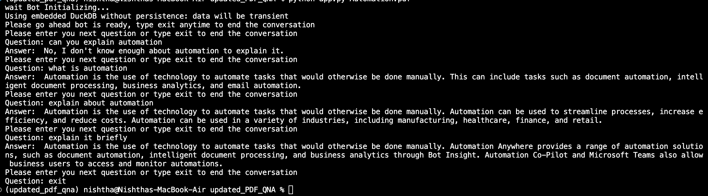

# ChatGPT

## CHATGPT with PDF for QNA
#### Preferred Python Version
Python=3.8.10
#### How to run setup the chatGPT with pdf for QNA
* cd pdf_to_qna/ 
* chmod 777 setup.sh
* ./setup.sh 
#### How to run run the chatGPT with pdf for QNA
* chmod 777 run.sh 
* In run.sh pass the file path at the 2nd line
* ./run.sh
#### Ready
You can ask the question now via terminal
  

## CHATGPT for creating a bot for excel with Chatbot using Excel Package
#### Preferred Python Version
Python=3.8.10
#### How to run setup the chatGPT with Excel automation for QNA
* cd Excel_Bot/ 
* chmod 777 setup.sh 
* ./setup.sh 
#### How to run run the chatGPT with Excel automation for QNA
* chmod 777 run.sh 
* ./run.sh 
#### Ready
* You can ask the question now via terminal

NOTE : Please pass your own OPENAI_API_KEY in .env file  
